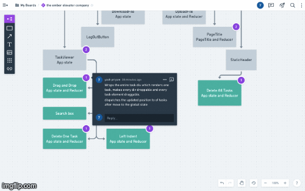

# Curriculum Authoring Tool

It is a tool which allows educators to create a an ordered learn journey or a lesson plan for a subject, chapter or a topic.

[](https://github.com/anuraghazra/github-readme-stats)

## Live Tool

**[Authoring Tool Live](https://toddle-tool.netlify.app/)**

## Project Demo


## App Structure Flow



### GIFs can't be paused, so if you want to pause and read through the code flow,

### here is the [YOUTUBE LINK FOR APP STRUCTURE FLOW](https://youtu.be/rzCp5etJPqE), without audio

Currently the tool supports 3 levels of nesting or parent-child relationship.

## Features

- [x] **Sign In - Sign out:** For users to start with the tool, they need to Sign in to the application using their google id.
- [x] **Indent - Outdent:** For creating or removing parent child relations between tasks.
- [x] **Delete Task:** For removing individual tasks at any level.
- [x] Deleting tasks deletes all the child elements of the tasks, if any.
- [x] **Delete All** Task: For removing all tasks at once.
- [x] **Moving Task:** Drag and Drop tasks, change their positions along with their children, if any.
- [x] Moving Tasks with children: Tasks, having children, are dragged and moved with their children.
- [x] **In-line Task Edit:** For editing saved tasks at any level.
- [x] **Page Title:** Declare title of the page on the top. This title becomes file name of the downloaded json file.
      This title is also set as per the file name of the uploaded file automatically.
- [x] **Upload/ Download** - Downloads the json format of the strucutre with all the parent child relations preserved.
      Upload a json file in the correct format to get the structure built on the UI with all the parent child relations.
- [x] **Tooltip:** on hovering the control buttons, a tooltip pops up stating the action that they control.
- [x] **Search bar:** text based search box for searching through task values.

## Features which are in-developement:

- Action buttons control when searched list is in display
- Test cases

## The tool allows DOWNLOADING the content with order preserved in a JSON format. A typical downloaded json would look like:

```
[
    {"value":"Shapes","level":1,"id":"23409d84-363d-4c90-a42d-d6ea0ddea340"},
    {"value":"Lines","level":2,"id":"be43eb8f-a976-476f-96f5-8ca71886b8d8"},
    {"value":"Triangles","level":2,"id":"7f9579ea-e4c4-4b66-8d98-62c695084a1c"},
    {"value":"Circles","level":2,"id":"23cf4811-e62e-402f-9db2-96d68102cb1c"},
    {"value":"Polynomials","level":1,"id":"402b041d-4eae-4b25-91b7-bdef574fd822"},
    {"value":"Numbers","level":1,"id":"3d8f358c-8bb8-4e87-883c-025bb2b81fb1"},
    {"value":"Fractions","level":2,"id":"1c24669c-5b73-4501-aa67-5399b98cabdb"},
    {"value":"Integers","level":2,"id":"f244e7bb-2c2c-4687-97b8-8aa31c0e47a0"},
    {"value":"RealNumbers","level":2,"id":"4486ec9b-9979-4510-81ff-177e9bb37b70"}
]
```

## Libraries and Frameworks used

- React.js (with Eslint, Prettier and Husky)
- Firebase for google authetication
- node-sass
- Fontawesome Icons
- uuidv4

## Liked the tool? Want to contribute? For getting started with the codebase:

The application uses es6.

```
$ git clone https://github.com/yashpriyam/teachers-authoring-cra.git
$ npm install
$ npm start
```
